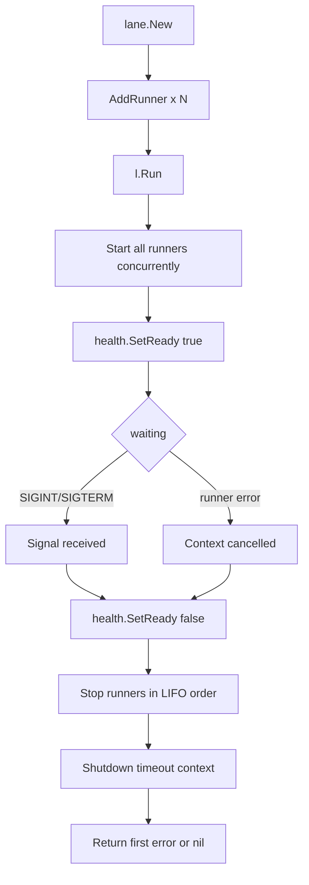

<p align="center">
  <a href="https://github.com/rluders/lane/actions/workflows/ci.yml">
    
  </a>
  <a href="https://go.dev/doc/devel/release">
    
  </a>
  <a href="https://pkg.go.dev/github.com/rluders/lane">
    
  </a>
  <a href="https://goreportcard.com/report/github.com/rluders/lane">
    
  </a>
  <a href="https://github.com/rluders/lane/releases">
    
  </a>
  <a href="https://codecov.io/gh/rluders/lane">
    
  </a>
  <a href="LICENSE">
    
  </a>
  
</p>

`lane` is a lightweight Go runtime that coordinates the lifecycle of service Runners.

## 🤔 What is lane?

`lane` manages the startup, health, and graceful shutdown of one or more service components — HTTP servers, background workers, schedulers — under a unified context. Register your runners, call `Run`, and lane handles the rest.

## 🎯 Why use it?

Wiring SIGINT/SIGTERM handling, concurrent startup, health probes, and ordered shutdown correctly is tedious boilerplate. `lane` does it once, predictably, so services stay focused on their own logic.

## 🚫 What it does NOT do

- It is not a dependency injection framework
- It does not wire, store, or own your service dependencies
- It does not prescribe configuration, logging format, or database access patterns
- It does not define application structure beyond the `Runner` interface

Dependency wiring is the caller's responsibility.

## ⚡ Quick Example

```go
package main

import (
    "context"
    "log/slog"
    "net/http"
    "os"
    "time"

    "github.com/rluders/lane"
    "github.com/rluders/lane/runners"
)

func main() {
    lane.RunHealthCheck(":8080")

    log := slog.New(slog.NewTextHandler(os.Stderr, nil))

    mux := http.NewServeMux()

    l := lane.New(log, lane.WithShutdownTimeout(10*time.Second))

    mux.Handle("GET /ready", lane.ReadinessHandler(l.Health()))
    mux.Handle("GET /live", lane.LivenessHandler())

    server := &http.Server{Addr: ":8080", Handler: mux}
    l.AddRunner(runners.NewHTTPRunner("api", server, log))

    if err := l.Run(context.Background()); err != nil {
        log.Error("lane error", "error", err)
        os.Exit(1)
    }
}
```

## 🔄 Lifecycle



Runners are started concurrently. Shutdown is sequential in **reverse registration order** (LIFO), so dependents stop before the services they depend on.

## 🧩 Runner Interface

Any component that can start and stop is a Runner:

```go
type Runner interface {
    Name() string
    Start(ctx context.Context) error
    Stop(ctx context.Context) error
}
```

**Contract:**
- `Start` **must block** until the runner stops or fails
- `Stop` initiates graceful shutdown and **must respect the context deadline**
- If `Start` returns a non-nil error, lane cancels all other runners

## 📦 Built-in Runners

All implementations live in the `runners/` sub-package.

| Runner | Constructor | Description |
|--------|-------------|-------------|
| HTTP | `runners.NewHTTPRunner(name, server, log)` | Wraps `*http.Server`. Calls `Shutdown` on stop. |
| HTTPS | `runners.NewHTTPSRunner(name, server, certFile, keyFile, log)` | Same as HTTPRunner with TLS. |
| Worker | `runners.NewWorkerRunner(name, fn, log)` | Runs a `WorkFn` in a loop until ctx is cancelled. |
| Scheduler | `runners.NewSchedulerRunner(name, interval, fn, log)` | Runs a `JobFn` on a fixed interval. Missed ticks are dropped. |

### Worker example

```go
worker := runners.NewWorkerRunner("processor", func(ctx context.Context) error {
    return processNextMessage(ctx)
}, log)
l.AddRunner(worker)
```

### Scheduler example

```go
sched := runners.NewSchedulerRunner("cleanup", 5*time.Minute, func(ctx context.Context) error {
    return purgeExpiredSessions(ctx)
}, log)
l.AddRunner(sched)
```

## 🏥 Health Checks

`HealthState` tracks readiness. Lane sets it to ready after all runners start, and back to not-ready at the beginning of shutdown.

```go
mux.Handle("GET /ready", lane.ReadinessHandler(l.Health(), db.PingContext))
mux.Handle("GET /live", lane.LivenessHandler())
```

`ReadinessHandler` accepts zero or more probe functions of type `func(ctx context.Context) error`. All probes must pass for the endpoint to return 200. If any probe fails, the endpoint returns 503.

`LivenessHandler` always returns 200 — a running process is a live process.

### Container health probe

Call `RunHealthCheck` at the very top of `main()` to support Docker `HEALTHCHECK CMD`-based probes:

```go
func main() {
    lane.RunHealthCheck(":8080")
    // ... rest of main
}
```

When invoked as `myservice healthcheck`, the process exits 0 (healthy) or 1 (unhealthy) immediately without starting the service.

## 🛡️ Recovery

### Goroutine recovery

`lane.Go` runs a goroutine with structured panic recovery. On panic it logs the stack trace and calls the provided cancel function to propagate the failure up to lane.

```go
lane.Go(ctx, log, "worker-name", cancel, func(ctx context.Context) {
    // critical goroutine — a panic here cancels the application context
})
```

### HTTP handler recovery

`RecoverMiddleware` wraps HTTP handlers with panic recovery. On panic it logs structured context (method, path, stack trace) and returns HTTP 500. The service continues — a single handler panic is recoverable.

```go
handler = lane.RecoverMiddleware(log)(handler)
```

## ⏱️ Shutdown Timeout

Default shutdown timeout is **30 seconds**. Override with `WithShutdownTimeout`:

```go
l := lane.New(log, lane.WithShutdownTimeout(10*time.Second))
```

Each runner's `Stop` is called with a context that respects this deadline. If a runner does not stop within the timeout, shutdown proceeds without it.

## 🗓️ When to use lane

Use it when you want:

- ✅ Go services with multiple concurrent components (API server + worker + scheduler)
- ✅ Predictable SIGTERM handling and readiness probes in containers
- ✅ Correct lifecycle management without pulling in a full service framework

Avoid it if you need:

- ❌ A dependency injection container
- ❌ A full application framework with routing conventions
- ❌ Managed configuration, observability, or deployment tooling

## 📄 License

MIT — see [LICENSE](LICENSE).
